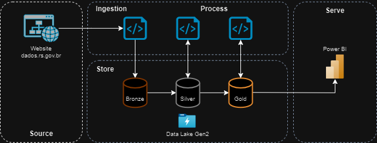
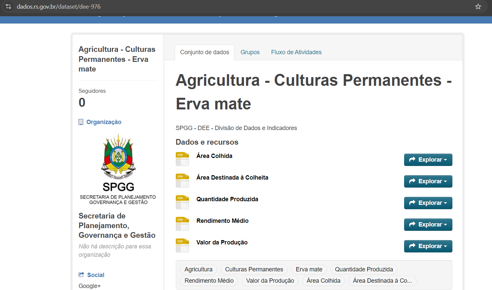
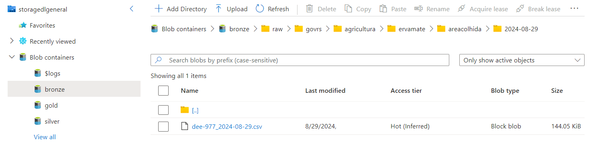
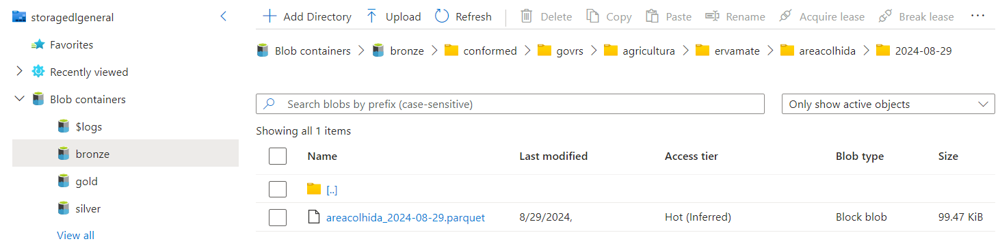
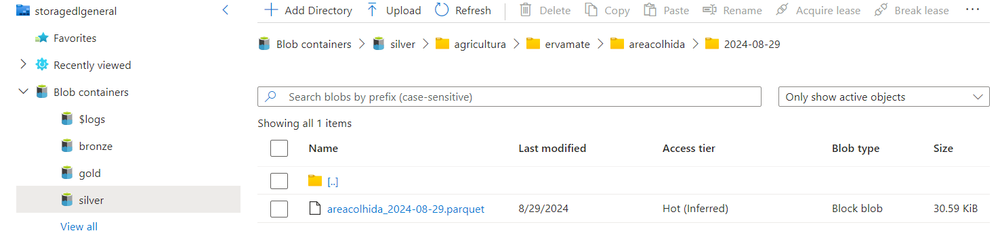
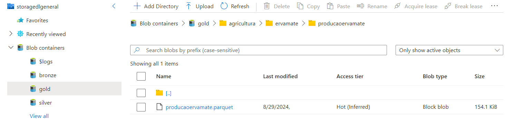
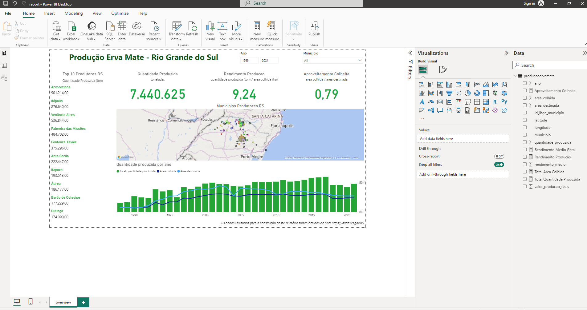

## Overview

This project aims to demonstrate a data ETL process with on-demand triggering from a python script, ingestion with storage, cleaning, transformation and processs considering the practices of a medallion architecture of a data lake. At the end, the pipeline delivery of a database that feeds a simple report with graphs that ilustrates the final processed data.



## Data Source

[Dados RS - Culturas Permanentes - Erva Mate](https://dados.rs.gov.br/dataset/dee-976)

## ETL


To run the project pipeline use this tutorial:

*In same path of the file pyproject.toml:*
```py
poetry install
```

Set the configurations of ingestion, in `main.py` file if necessary. The ETL pipeline happens here!

With poetry enviroment activated run the script in your terminal:
```py
task run
```

## Data Lake
>**Bronze Container** 

*raw*

*conformed*


>**Silver Container** 



>**Gold Container**



**Structure table in Gold**

| **Column** | **Description** |
|--------|-------------|
|id_ibge_municipio | IBGE identificator for Brazilian cities |
|municipio | City name. |
|latitude | City latitude. |
|longitude | City longitude. |
|ano | Year range from 1974 to 2021. |
|area_destinada | Intended area for harvesting  yerba mate in hectares (ha). |
|area_colhida |	Area of yerba mate harvested in hectares (ha). |
|quantidade_produzida |	Quantity of yerba mate produced in tons (t). |
|rendimento_medio |	Average yield of yerba mate in kilogram per hectare. |
|valor_producao_reais |	Production amount of yerba mate in Real currency.| 

## Serve
**Data Visualization**


## Important 
Most of this project can run without more costs with cloud, considering uses Azure free account linked to Power BI desktop:

[Azure - Free Account](https://azure.microsoft.com/en-us/pricing/purchase-options/azure-account)

[Power BI Desktop](https://www.microsoft.com/pt-br/download/details.aspx?id=58494)

For this project runs is necessary to set up Azure Storage Gen2 connection and configure authentication credentials with local environment variables for security process os ingestion and conection between your Azure account and your local files specially your python script. 
